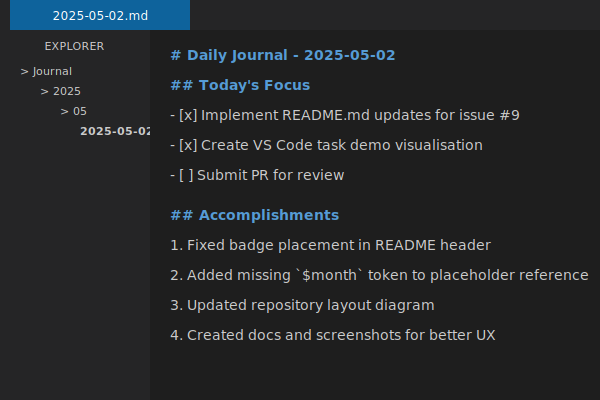

# 🗒️ Work-Journal

> Zero-friction Markdown journal for developers.

[](https://github.com/NicoSchwandner/WorkJournal/actions/workflows/ci.yml) [](https://www.npmjs.com/package/work-journal) [](https://github.com/NicoSchwandner/WorkJournal/blob/main/LICENSE)

## Why?

Keeping a lightweight text journal helps you…

- stay focussed instead of juggling half-finished tasks in your head
- surface blockers early and record decisions for future you
- give crystal-clear stand-up updates without scrolling Slack history
- see long-term progress (weekly / quarterly reflections)

Traditional "note apps" feel heavy, manual, or vendor-locked.  
**Work-Journal** lives in plain Markdown, plays nicely with Git, and automates the boring bits.

<figure>
  
  <figcaption>Clean, simple Markdown journals with task tracking.</figcaption>
</figure>

## Quick Start

<a id="quick-start"></a>

> **Node 18 +** is the only runtime requirement.

### Option A — _no tooling at all_ (30s)

```bash
git clone --depth 1 https://github.com/<you>/work-journal.git
cp work-journal/templates/daily_template.md .
# open in any editor, start writing
```

### Option B — _auto-generate today's entry_ (30s)

```bash
# one-shot (no global install)
npx work-journal new           # creates Journal/2025/05/2025-05-02.md
# or with pnpm
pnpm dlx work-journal new
```

```bash
# global install (optional)
pnpm add -g work-journal   # now 'work-journal new' works anywhere
alias wj="work-journal"    # use 'wj new' for even less friction
```

### Option C — _VS Code integration_

`.vscode/tasks.json`

```jsonc
{
  "label": "Journal: New Entry",
  "type": "shell",
  "command": "npx work-journal new",
  "presentation": { "reveal": "never" }
}
```

Hit <kbd>⌘⇧B</kbd> (or your build key) and the file opens ready for typing.

<figure>
  
  <figcaption>Hit ⇧⌘B and start writing.</figcaption>
</figure>

<a id="placeholder-ref"></a>

## Placeholder Reference

| Token        | Example      | Description            |
| ------------ | ------------ | ---------------------- |
| `$date`      | `2025-05-02` | ISO date (local TZ)    |
| `$week`      | `18`         | ISO-8601 week number   |
| `$month`     | `05`         | Two-digit month        |
| `$monthName` | `May`        | Localised long month   |
| `$quarter`   | `2`          | Calendar quarter (1-4) |
| `$year`      | `2025`       | Four-digit year        |

<a id="features"></a>

## Features

| ✅  | What                             | Notes                                                          |
| --- | -------------------------------- | -------------------------------------------------------------- |
| ✅  | **Template engine**              | Daily, weekly, monthly, quarterly, yearly                      |
| ✅  | **Three-level lookup**           | `./templates/` → `~/.config/work-journal/` → packaged defaults |
| ✅  | **Cross-platform**               | Works on macOS, Linux, Windows (no Bash)                       |
| ✅  | **Configurable holiday cutoff**  | `work-journal config set holidayCutoffDay 23`                  |
| 🏗   | **Binary release**               | Planned (skip for v1)                                          |
| 🏗   | **Custom placeholder variables** | Road-mapped                                                    |

<a id="template-override"></a>

## Template Override Lookup

```
┌───────────────┐     ┌────────────────────────┐     ┌────────────────────────┐
│ ./templates/  │ → │ ~/.config/work-journal/ │ → │ packaged defaults (npm) │
└───────────────┘     └────────────────────────┘     └────────────────────────┘
```

> **Note**: The `templates/` folder is case-sensitive. If both `templates/` and `Templates/` exist in the same project, an error will be thrown. If only `Templates/` exists, it will be used with a warning. We recommend using lowercase `templates/` for consistency.

## Configuration Examples

```bash
# Set last Friday before X-mas break to Dec 20 instead of 23
npx work-journal config set holidayCutoffDay 20
npx work-journal config get holidayCutoffDay
# 20

# Set in project config (default)
npx work-journal config set holidayCutoffDay 22
# Set in user config
npx work-journal config set holidayCutoffDay 22 --user
```

### Environment Variable Configuration

You can override configuration using environment variables with the prefix `WORK_JOURNAL_`. Environment variables take precedence over both project and user configuration files.

```bash
# Unix/Linux/macOS
export WORK_JOURNAL_HOLIDAY_CUTOFF_DAY=22
npx work-journal new

# Windows
set WORK_JOURNAL_HOLIDAY_CUTOFF_DAY=22
npx work-journal new
```

| Environment Variable              | Config Key         | Example Value | Description                              |
| --------------------------------- | ------------------ | ------------- | ---------------------------------------- |
| `WORK_JOURNAL_HOLIDAY_CUTOFF_DAY` | `holidayCutoffDay` | `22`          | Day of December to use as holiday cutoff |

<a id="repo-layout"></a>

## Repository Layout

```
work-journal/
├─ templates/          # default Markdown templates
├─ packages/
│   └─ cli/            # TypeScript CLI (published as "work-journal")
│       └─ dist/       # Compiled JavaScript (post-build)
├─ .changeset/         # Release change descriptions
├─ .cursor/rules/      # Cursor AI coding rules
├─ .github/workflows/  # CI matrix & release
└─ README.md
```

<a id="cli-reference"></a>

## CLI Reference

<details>
<summary>work-journal --help</summary>

```text
work-journal <command>

Commands:
  work-journal init      seed templates in ./templates
                         --user: copy to user config dir instead of project
  work-journal new       create or append to today's journal entry
  work-journal config    Manage configuration
                         set --user: save to user config instead of project

Options:
  --version  Show version number                                       [boolean]
  --help     Show help                                                 [boolean]
```

</details>

<a id="developing"></a>

## Developing & Testing

```bash
pnpm install
pnpm -r run build      # compile CLI
pnpm test              # Vitest unit + integration suite
```

GitHub Actions runs the same tests on Ubuntu, macOS, and Windows with Node 18 & 20.

<a id="contributing"></a>

## Contributing

1. Fork & create a feature branch.
2. Make your changes and add a changeset:
   - Interactive mode: `pnpm changeset`
   - Non-interactive: `./create-changeset.sh work-journal patch "Description of your change"`
3. Add or update tests.
4. Open a PR — CI must pass before merge.

> **Note for Node 20+ users**: If you don't have pnpm installed, run `corepack enable` to use the version pinned in the repo.

Once merged to main, the GitHub Actions workflow will:

1. Detect any changeset files and create a Version Package PR
2. When that PR is merged, automatically publish the package to npm

### Release Process

We use [Changesets](https://github.com/changesets/changesets) to manage versioning and publishing:

1. When making a change, create a changeset file using one of these commands:

   - `pnpm changeset` - Interactive mode
   - `pnpm run changeset:patch` - Non-interactive patch version bump with default message
   - `pnpm run changeset:minor` - Non-interactive minor version bump with default message
   - `pnpm run changeset:major` - Non-interactive major version bump with default message
   - `./create-changeset.sh work-journal patch "Your specific message"` - Custom message

2. Commit the generated file in `.changeset/` with your changes

3. On merge to main, a GitHub Action will automatically:
   - Use the changesets to determine the next version
   - Create a PR to update all package versions
   - When that PR is merged, publish packages to npm

<a id="roadmap"></a>

## Roadmap

- [ ] Bundle single-file binaries via `pkg`
- [ ] Internationalisation (date format + template language)
- [ ] Optional daily cron GitHub Action that PRs tomorrow's entry
- [ ] Editor snippets for JetBrains / Vim

<a id="pre-commit"></a>

## Pre-commit Hook Suggestion

We recommend running tests and linting before pushing changes:

```bash
npx husky add .husky/pre-push "pnpm test && npx markdownlint-cli2 ."
```

<a id="license"></a>

## License

[Apache 2.0](LICENSE)

---

Made with 💚 in Göteborg
